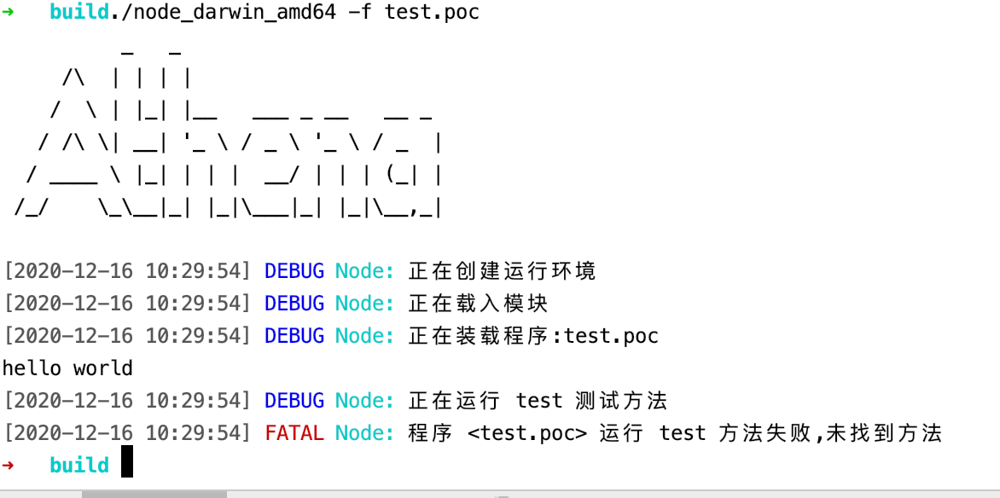

# 基础语法

Athena 在脚本引擎中反复挑选测试，最终还是选择了 `Lua` 语言，近期作者已经逐渐习惯了lua的语法

首先这是一门反 `编程人员` 的语言，但是不是一门反人类的语言

比如数组第一个成员的下标是`1`，编写插件的时候经常搞错

!> 作者对lua进行了简单的魔改，使其可以适当的完成工作,请编写前阅读文档以进行插件的编写

## 开始运行
新建一个文件,此处以`test.poc`为例

文件内容
```poc
print("hello world")
```
运行结果



此处下方有FATAL报错信息，原因就是框架功能的体现，标准化，框架是通过test方法进行测试可用性


## 基本语句

Athena 中使用的脚本引擎为 `Lua` 但是进行了一定程度的魔改,下称`本引擎`

### 引言

在进行扫描器构思的时候，摆在眼前的一个问题就是，如何方便的进行漏洞的 添加/测试

在该脚本引擎以前，其实是有过其他方案的产生，同时这个方案也是作者停止更新许久的纠结点

最初版本的扫描器叫什么名字，使用过本平台的小伙伴们都知道，我也不想再提起来了

原本的设计理念是通过纯粹的`python`来进行节点的构建，这样作，一部分是因为环境部署比较方便，还有一部分原因是linux里面默认会自带`python`环境

当然还有一个比较重要的点，对内存的镜像毕竟不是所有人都会作，通过`python`可以进行纯内存加载，加大取证的难度

但是现在`python`的火爆程度，推着`python`一路前进，版本更新迭代非常快，从原本的`2.7`主流版本，推到现在的`python3`,而且是各个小分支齐头并进

让人分不出来这到底是一门迭代多年稳定的`壮年`语言，还是一门新生`好动`的语言，如果插件代码都随着外层主流环境的变更不断推进，改动成本比较大

**基于上述描述**

作者想到通过一层中间的解释器，来对`python`和插件运行环境有一个较稳定的支持，同样可以有`python`便捷的运行

经过作者一段时间的尝试，发现大概我真的是太菜了，真的顶不住了，写出来的解释器，速度比较不理想，应该说，非常不理想

大概匹配端口的服务需要2秒钟左右，1w规则，如果扫的端口多一点，直接上天了

加上`python3`有较大的变动，所以还是不打算继续使用`python`了，相比如此有活力的语言，我们大概更需要一门简单稳定的语言

同时因为我们并不打算使插件具有移植性，所以直接对解释器进行了一定程度的魔改

大概以后会出个离线版扫描的程序，可以供控制台调用，在本地进行联动的扫描，或者直接从现有解释器增加本地流程化调用的功能


### 第一个程序

Athena支持了交互式的命令行

在编辑器内输入如下代码

```poc
print('hello, world')
```

把文件保存为 `test.poc` ，就可以打开命令行窗口，把当前目录切换到 `Athena` 所在目录，就可以运行这个程序了:


也可以保存为别的名字，比如 `xx.poc`，我们建议是以 `.poc` 结尾。

### 数据类型

数据类型 | 描述
---- | ----
`nil` | 这个最简单，只有值nil属于该类，表示一个无效值（在条件表达式中相当于false）。
`boolean` | 包含两个值：false和true。
`number` | 表示双精度类型的实浮点数
`string` | 字符串由一对双引号或单引号来表示
`function` | 由 C 或 Lua 编写的函数
`userdata` | 表示任意存储在变量中的C数据结构
`thread` | 表示执行的独立线路，用于执行协同程序
`table` | 表（table）其实是一个"关联数组"（associative arrays），数组的索引可以是数字、字符串或表类型。table 的创建是通过"构造表达式"来完成，最简单构造表达式是{}，用来创建一个空表。

```poc
print(type("Hello world"))      --> string
print(type(10.4*3))             --> number
print(type(print))              --> function
print(type(type))               --> function
print(type(true))               --> boolean
print(type(nil))                --> nil
print(type(type(X)))            --> string

```

**nil 空**

nil 类型表示一种没有任何有效值，它只有一个值 -- nil，例如打印一个没有赋值的变量，便会输出一个 nil 值：

```poc
> print(type(a))
nil
>
```

对于全局变量和 table，nil 还有一个"删除"作用，给全局变量或者 table 表里的变量赋一个 nil 值，等同于把它们删掉，执行下面代码就知：

```poc
tab1 = { key1 = "val1", key2 = "val2", "val3" }
for k, v in pairs(tab1) do
    print(k .. " - " .. v)
end
 
tab1.key1 = nil
for k, v in pairs(tab1) do
    print(k .. " - " .. v)
end
```

nil 作比较时应该加上双引号 `"`

```poc
> type(X)
nil
> type(X)==nil
false
> type(X)=="nil"
true
>
```

`type(X)==nil` 结果为 `false` 的原因是 `type(X)` 实质是返回的 `"nil"` 字符串，是一个 `string` 类型：

```poc
type(type(X))==string
```

**boolean 布尔**

boolean 类型只有两个可选值：true（真） 和 false（假），Lua 把 false 和 nil 看作是 false，其他的都为 true，数字 0 也是 true:

```poc
print(type(true))
print(type(false))
print(type(nil))
 
if false or nil then
    print("至少有一个是 true")
else
    print("false 和 nil 都为 false")
end

if 0 then
    print("数字 0 是 true")
else
    print("数字 0 为 false")
end
```

以上代码执行结果如下：

```
$ node_darwin_amd64 -f test.poc
boolean
boolean
nil
false 和 nil 都为 false
数字 0 是 true
```

**number 数字**

Lua 默认只有一种 number 类型 -- double（双精度）类型（默认类型可以修改 luaconf.h 里的定义），以下几种写法都被看作是 number 类型：

```poc
print(type(2))
print(type(2.2))
print(type(0.2))
print(type(2e+1))
print(type(0.2e-1))
print(type(7.8263692594256e-06))
```
以上代码执行结果：

```
number
number
number
number
number
number
```
**string 字符串**

字符串由一对双引号或单引号来表示。

```poc
string1 = "this is string1"
string2 = 'this is string2'
```

也可以用 2 个方括号 "[[]]" 来表示"一块"字符串。

```poc
html = [[
<html>
<head></head>
<body>
    <a href="http://www.runoob.com/">菜鸟教程</a>
</body>
</html>
]]
print(html)
```

在对一个数字字符串上进行算术操作时，解释器会尝试将这个数字字符串转成一个数字:

```poc
> print("2" + 6)
8.0
> print("2" + "6")
8.0
> print("2 + 6")
2 + 6
> print("-2e2" * "6")
-1200.0
> print("error" + 1)
stdin:1: attempt to perform arithmetic on a string value
stack traceback:
        stdin:1: in main chunk
        [C]: in ?
>
```

以上代码中"error" + 1执行报错了，字符串连接使用的是 .. ，如：

```poc
> print("a" .. 'b')
ab
> print(157 .. 428)
157428
> 
```
使用 # 来计算字符串的长度，放在字符串前面，如下实例：

```poc
> len = "c0cc.cc"
> print(#len)
> print(#"c0cc.cc")

```

**table 表**

在 Lua 里，table 的创建是通过"构造表达式"来完成，最简单构造表达式是{}，用来创建一个空表。也可以在表里添加一些数据，直接初始化表:

```poc
-- 创建一个空的 table
local tbl1 = {}
 
-- 直接初始表
local tbl2 = {"apple", "pear", "orange", "grape"}
```
表（table）其实是一个"关联数组"（associative arrays），数组的索引可以是数字或者是字符串。

```poc
a = {}
a["key"] = "value"
key = 10
a[key] = 22
a[key] = a[key] + 11
for k, v in pairs(a) do
    print(k .. " : " .. v)
end
```

脚本执行结果为：

```
$ node_darwin_amd64 -f table_test.poc 
key : value
10 : 33
```

不同于其他语言的数组把 0 作为数组的初始索引，在 该解释器 里表的默认初始索引一般以 1 开始。

```poc
local tbl = {"apple", "pear", "orange", "grape"}
for key, val in pairs(tbl) do
    print("Key", key)
end
```

脚本执行结果为：

```
$ node_darwin_amd64 -f table_test2.poc 
Key    1
Key    2
Key    3
Key    4
```

table 不会固定长度大小，有新数据添加时 table 长度会自动增长，没初始的 table 都是 nil。

```poc
a3 = {}
for i = 1, 10 do
    a3[i] = i
end
a3["key"] = "val"
print(a3["key"])
print(a3["none"])
```

脚本执行结果为：

```
$ node_darwin_amd64 -f table_test3.poc 
val
nil
```

**function 函数**

在 解释器 中，函数是被看作是"第一类值（First-Class Value）"，函数可以存在变量里:

```poc
function factorial1(n)
    if n == 0 then
        return 1
    else
        return n * factorial1(n - 1)
    end
end
print(factorial1(5))
factorial2 = factorial1
print(factorial2(5))
```

脚本执行结果为：

```
$ node_darwin_amd64 -f function_test.poc 
120
120
```
function 可以以匿名函数（anonymous function）的方式通过参数传递:

```poc
function testFun(tab,fun)
        for k ,v in pairs(tab) do
                print(fun(k,v));
        end
end


tab={key1="val1",key2="val2"};
testFun(tab,
function(key,val)--匿名函数
        return key.."="..val;
end
)
```

脚本执行结果为：

```
$ node_darwin_amd64 -f function_test2.poc 
key1 = val1
key2 = val2
```

**thread 线程**

在 解释器 里，最主要的线程是协同程序（coroutine）。它跟线程（thread）差不多，拥有自己独立的栈、局部变量和指令指针，可以跟其他协同程序共享全局变量和其他大部分东西。

线程跟协程的区别：线程可以同时多个运行，而协程任意时刻只能运行一个，并且处于运行状态的协程只有被挂起（suspend）时才会暂停。

**userdata 自定义类型**

userdata 是一种用户自定义数据，用于表示一种由应用程序或 C/C++ 语言库所创建的类型，可以将任意 C/C++ 的任意数据类型的数据（通常是 struct 和 指针）存储到 Lua 变量中调用

### 变量

变量在使用前，需要在代码中进行声明，即创建该变量。

编译程序执行代码之前编译器需要知道如何给语句变量开辟存储区，用于存储变量的值。

变量有三种类型：全局变量、局部变量、表中的域。

解释器 中的变量全是全局变量，那怕是语句块或是函数里，除非用 local 显式声明为局部变量。

局部变量的作用域为从声明位置开始到所在语句块结束。

变量的默认值均为 nil。


```poc
a = 5               -- 全局变量
local b = 5         -- 局部变量

function joke()
    c = 5           -- 全局变量
    local d = 6     -- 局部变量
end

joke()
print(c,d)          --> 5 nil

do
    local a = 6     -- 局部变量
    b = 6           -- 对局部变量重新赋值
    print(a,b);     --> 6 6
end

print(a,b)      --> 5 6
```
执行以上实例输出结果为：

```
$ node_darwin_amd64 -f test.poc 
5    nil
6    6
5    6
```

**赋值语句**

赋值是改变一个变量的值和改变表域的最基本的方法。

```poc
a = "hello" .. "world"
t.n = t.n + 1
```

可以对多个变量同时赋值，变量列表和值列表的各个元素用逗号分开，赋值语句右边的值会依次赋给左边的变量。

```poc
a, b = 10, 2*x       <-->       a=10; b=2*x
```
遇到赋值语句Lua会先计算右边所有的值然后再执行赋值操作，所以我们可以这样进行交换变量的值：

```poc
x, y = y, x                     -- swap 'x' for 'y'
a[i], a[j] = a[j], a[i]         -- swap 'a[i]' for 'a[j]'
```

当变量个数和值的个数不一致时，Lua会一直以变量个数为基础采取以下策略：

```poc
a. 变量个数 > 值的个数             按变量个数补足nil
b. 变量个数 < 值的个数             多余的值会被忽略
```

```poc
a, b, c = 0, 1
print(a,b,c)             --> 0   1   nil
 
a, b = a+1, b+1, b+2     -- value of b+2 is ignored
print(a,b)               --> 1   2
 
a, b, c = 0
print(a,b,c)             --> 0   nil   nil
```

上面最后一个例子是一个常见的错误情况，注意：如果要对多个变量赋值必须依次对每个变量赋值。

```poc
a, b, c = 0, 0, 0
print(a,b,c)             --> 0   0   0
```

多值赋值经常用来交换变量，或将函数调用返回给变量：

```poc
a, b = f()
```

f()返回两个值，第一个赋给a，第二个赋给b。

应该尽可能的使用局部变量，有两个好处：

- 避免命名冲突。
- 访问局部变量的速度比全局变量更快。

**索引**

对 table 的索引使用方括号 []。也提供了 . 操作。

```poc
t[i]
t.i                 -- 当索引为字符串类型时的一种简化写法
gettable_event(t,i) -- 采用索引访问本质上是一个类似这样的函数调用
```

```poc
> site = {}
> site["key"] = "c0cc.cc"
> print(site["key"])
> print(site.key)
```

### 数组

**一维数组**

```poc
array = {"Lua", "Tutorial"}

for i= 0, 2 do
   print(array[i])
end
```

以上代码执行输出结果为：

```
nil
Lua
Tutorial
```

正如你所看到的，我们可以使用整数索引来访问数组元素，如果知道的索引没有值则返回nil。

解释器 索引值是以 1 为起始，但你也可以指定 0 开始。

除此外我们还可以以负数为数组索引值：

```poc
array = {}

for i= -2, 2 do
   array[i] = i *2
end

for i = -2,2 do
   print(array[i])
end
```
以上代码执行输出结果为：

```
-4
-2
0
2
4
```
**多维数组**

多维数组即数组中包含数组或一维数组的索引键对应一个数组。

以下是一个三行三列的阵列多维数组：

```poc
-- 初始化数组
array = {}
for i=1,3 do
   array[i] = {}
      for j=1,3 do
         array[i][j] = i*j
      end
end

-- 访问数组
for i=1,3 do
   for j=1,3 do
      print(array[i][j])
   end
end
```

以上代码执行输出结果为：

```
1
2
3
2
4
6
3
6
9
```
不同索引键的三行三列阵列多维数组：

```poc
-- 初始化数组
array = {}
maxRows = 3
maxColumns = 3
for row=1,maxRows do
   for col=1,maxColumns do
      array[row*maxColumns +col] = row*col
   end
end

-- 访问数组
for row=1,maxRows do
   for col=1,maxColumns do
      print(array[row*maxColumns +col])
   end
end
```

以上代码执行输出结果为：

```
1
2
3
2
4
6
3
6
9
```

正如你所看到的，以上的实例中，数组设定了指定的索引值，这样可以避免出现 nil 值，有利于节省内存空间。


### 运算符

- 算术运算符
- 关系运算符
- 逻辑运算符
- 其他运算符

**算术运算符**

下表列出了常用算术运算符，设定 A 的值为10，B 的值为 20：

操作符 | 描述 | 实例
---- | ---- | ----
`+` | 加法 | A + B 输出结果 30
`-` | 减法 | A - B 输出结果 -10
`*` | 乘法 | A * B 输出结果 200
`/` | 除法 | B / A w输出结果 2
`%` | 取余 | B % A 输出结果 0
`^` | 乘幂 | A^2 输出结果 100
`-` | 负号 | -A 输出结果 -10
`&` | 与 | A & B 输出结果 0
&#124; | 或 | A &#124; B 输出结果 30
`~` | 异或 | A `~` B 输出结果 30
`<<` | 左移 | A `<<` B 输出结果 10485760 (A必须为整数,B必须为正整数)
`>>` | 右移 | A `>>` B 输出结果 0 (A必须为整数,B必须为正整数)

实例

```poc
a = 21
b = 10
c = a + b
print("Line 1 - c 的值为 ", c )
c = a - b
print("Line 2 - c 的值为 ", c )
c = a * b
print("Line 3 - c 的值为 ", c )
c = a / b
print("Line 4 - c 的值为 ", c )
c = a % b
print("Line 5 - c 的值为 ", c )
c = a^2
print("Line 6 - c 的值为 ", c )
c = -a
print("Line 7 - c 的值为 ", c )
c = a & b
print("Line 8 - c 的值为 ", c )
c = a | b
print("Line 9 - c 的值为 ", c )
c = a ~ b
print("Line 10 - c 的值为 ", c )
c = a >> b
print("Line 11 - c 的值为 ", c )
c = a << b
print("Line 12 - c 的值为 ", c )
```

以上程序执行结果为：

```poc
Line 1 - c 的值为     31
Line 2 - c 的值为     11
Line 3 - c 的值为     210
Line 4 - c 的值为     2.1
Line 5 - c 的值为     1
Line 6 - c 的值为     441
Line 7 - c 的值为     -21
Line 8 - c 的值为     0
Line 9 - c 的值为     30
Line 10 - c 的值为    30
Line 11 - c 的值为    10485760
Line 12 - c 的值为    0
```

**关系运算符**

下表列出了常用关系运算符，设定 A 的值为10，B 的值为 20：

操作符 | 描述 | 实例
---- | ---- | ----
`==` | 等于，检测两个值是否相等，相等返回 true，否则返回false | (A == B) 为 false。
`~=` | 不等于，检测两个值是否相等，不相等返回 true，否则返回 false  | (A ~= B) 为 true。
`>` | 大于，如果左边的值大于右边的值，返回 true，否则返回 false | (A > B) 为 false。
`<` | 小于，如果左边的值大于右边的值，返回 false，否则返回 true | (A < B) 为 true。
`>=` | 大于等于，如果左边的值大于等于右边的值，返回 true，否则返回 false | (A >= B) 返回 false。
`<=` | 小于等于， 如果左边的值小于等于右边的值，返回 true，否则返回 false | (A <= B) 返回 true。

实例

```poc
a = 21
b = 10

if( a == b )
then
   print("Line 1 - a 等于 b" )
else
   print("Line 1 - a 不等于 b" )
end

if( a ~= b )
then
   print("Line 2 - a 不等于 b" )
else
   print("Line 2 - a 等于 b" )
end

if ( a < b )
then
   print("Line 3 - a 小于 b" )
else
   print("Line 3 - a 大于等于 b" )
end

if ( a > b )
then
   print("Line 4 - a 大于 b" )
else
   print("Line 5 - a 小于等于 b" )
end

-- 修改 a 和 b 的值
a = 5
b = 20
if ( a <= b )
then
   print("Line 5 - a 小于等于  b" )
end

if ( b >= a )
then
   print("Line 6 - b 大于等于 a" )
end
```
以上程序执行结果为：

```poc
Line 1 - a 不等于 b
Line 2 - a 不等于 b
Line 3 - a 大于等于 b
Line 4 - a 大于 b
Line 5 - a 小于等于  b
Line 6 - b 大于等于 a
```

**逻辑运算符**

下表列出了常用逻辑运算符，设定 A 的值为 true，B 的值为 false：

操作符 | 描述 | 实例
---- | ---- | ----
`and` | 逻辑与操作符。 若 A 为 false，则返回 A，否则返回 B。 | (A and B) 为 false。
`or` | 逻辑或操作符。 若 A 为 true，则返回 A，否则返回 B。 | (A or B) 为 true。
`not` | 逻辑非操作符。与逻辑运算结果相反，如果条件为 true，逻辑非为 false。 | not(A and B) 为 true。

实例

```poc
a = true
b = true

if ( a and b )
then
   print("a and b - 条件为 true" )
end

if ( a or b )
then
   print("a or b - 条件为 true" )
end

print("---------分割线---------" )

-- 修改 a 和 b 的值
a = false
b = true

if ( a and b )
then
   print("a and b - 条件为 true" )
else
   print("a and b - 条件为 false" )
end

if ( not( a and b) )
then
   print("not( a and b) - 条件为 true" )
else
   print("not( a and b) - 条件为 false" )
end
```

以上程序执行结果为：

```poc
a and b - 条件为 true
a or b - 条件为 true
---------分割线---------
a and b - 条件为 false
not( a and b) - 条件为 true
```

**其他运算符**

下表列出了连接运算符与计算表或字符串长度的运算符：

操作符 | 描述 | 实例
---- | ---- | ----
`..` | 连接两个字符串 | a..b ，其中 a 为 "Hello " ， b 为 "World", 输出结果为 "Hello World"。
`#` | 一元运算符，返回字符串或表的长度。 | #"Hello" 返回 5

实例

```poc
a = "Hello "
b = "World"

print("连接字符串 a 和 b ", a..b )

print("b 字符串长度 ",#b )

print("字符串 Test 长度 ",#"Test" )

```
以上程序执行结果为：

```poc
连接字符串 a 和 b     Hello World
b 字符串长度     5
字符串 Test 长度     4
```

**运算符优先级**

运算高低优先级

```poc
^
not    - (unary)
*      /       %
+      -
..
<      >      <=     >=     ~=     ==
and
or
```
除了 `^` 和 `..` 外所有的二元运算符都是左连接的。

```poc
a+i < b/2+1          <-->       (a+i) < ((b/2)+1)
5+x^2*8              <-->       5+((x^2)*8)
a < y and y <= z     <-->       (a < y) and (y <= z)
-x^2                 <-->       -(x^2)
x^y^z                <-->       x^(y^z)
```

实例

```poc
a = 20
b = 10
c = 15
d = 5

e = (a + b) * c / d;-- ( 30 * 15 ) / 5
print("(a + b) * c / d 运算值为  :",e )

e = ((a + b) * c) / d; -- (30 * 15 ) / 5
print("((a + b) * c) / d 运算值为 :",e )

e = (a + b) * (c / d);-- (30) * (15/5)
print("(a + b) * (c / d) 运算值为 :",e )

e = a + (b * c) / d;  -- 20 + (150/5)
print("a + (b * c) / d 运算值为   :",e )
```

以上程序执行结果为：

```poc
(a + b) * c / d 运算值为  :    90.0
((a + b) * c) / d 运算值为 :    90.0
(a + b) * (c / d) 运算值为 :    90.0
a + (b * c) / d 运算值为   :    50.0
```


### 逻辑语句

很多情况下我们需要做一些有规律性的重复操作，因此在程序中就需要重复执行某些语句。

一组被重复执行的语句称之为循环体，能否继续重复，决定循环的终止条件。

循环结构是在一定条件下反复执行某段程序的流程结构，被反复执行的程序被称为循环体。

循环语句是由循环体及循环的终止条件两部分组成的。

循环类型 | 描述
---- | ----
while 循环 | 在条件为 true 时，让程序重复地执行某些语句。执行语句前会先检查条件是否为 true。
for 循环 | 重复执行指定语句，重复次数可在 for 语句中控制。
repeat...until | 重复执行循环，直到 指定的条件为真时为止
循环嵌套 | 可以在循环内嵌套一个或多个循环语句（while do ... end;for ... do ... end;repeat ... until;）

**循环控制语句**

循环控制语句用于控制程序的流程， 以实现程序的各种结构方式。

控制语句 | 描述
---- | ----
break 语句 | 退出当前循环或语句，并开始脚本执行紧接着的语句。
goto 语句 | 将程序的控制点转移到一个标签处。


**无限循环**

在循环体中如果条件永远为 true 循环语句就会永远执行下去，以下以 while 循环为例：

```poc
while( true )
do
   print("循环将永远执行下去")
end
```

**流程控制**

流程控制语句通过程序设定一个或多个条件语句来设定。在条件为 true 时执行指定程序代码，在条件为 false 时执行其他指定代码


控制结构的条件表达式结果可以是任何值，解释器 认为false和nil为假，true和非nil为真。

要注意的是解释器中 0 为 true：

```poc
--[ 0 为 true ]
if(0)
then
    print("0 为 true")
end
```
以上代码输出结果为：

```poc
0 为 true
```

解释器提供了以下控制结构语句

语句 | 描述
---- | ----
if 语句 | if 语句 由一个布尔表达式作为条件判断，其后紧跟其他语句组成。
if...else 语句 | if 语句 可以与 else 语句搭配使用, 在 if 条件表达式为 false 时执行 else 语句代码。
if 嵌套语句 | 你可以在if 或 else if中使用一个或多个 if 或 else if 语句 。


### 函数和闭包

**函数定义**

函数定义格式如下

```poc
optional_function_scope function function_name( argument1, argument2, argument3..., argumentn)
    function_body
    return result_params_comma_separated
end
```

解析：

- optional_function_scope: 该参数是可选的制定函数是全局函数还是局部函数，未设置该参数默认为全局函数，如果你需要设置函数为局部函数需要使用关键字 local。
- function_name: 指定函数名称。
- argument1, argument2, argument3..., argumentn: 函数参数，多个参数以逗号隔开，函数也可以不带参数。
- function_body: 函数体，函数中需要执行的代码语句块。
- result_params_comma_separated: 函数返回值，Lua语言函数可以返回多个值，每个值以逗号隔开。

实例

以下实例定义了函数 max()，参数为 num1, num2，用于比较两值的大小，并返回最大值：
```poc
--[[ 函数返回两个值的最大值 --]]
function max(num1, num2)

   if (num1 > num2) then
      result = num1;
   else
      result = num2;
   end

   return result;
end
-- 调用函数
print("两值比较最大值为 ",max(10,4))
print("两值比较最大值为 ",max(5,6))
```

以上代码执行结果为：

```
两值比较最大值为     10
两值比较最大值为     6
```

我们可以将函数作为参数传递给函数，如下实例

```poc
myprint = function(param)
   print("这是打印函数 -   ##",param,"##")
end

function add(num1,num2,functionPrint)
   result = num1 + num2
   -- 调用传递的函数参数
   functionPrint(result)
end
myprint(10)
-- myprint 函数作为参数传递
add(2,5,myprint)
```
以上代码执行结果为：

```
这是打印函数 -   ##    10    ##
这是打印函数 -   ##    7    ##
```

**多返回值**

函数可以返回多个结果值，比如string.find，其返回匹配串"开始和结束的下标"（如果不存在匹配串返回nil）

```poc
> s, e = string.find("www.c0cc.cc", "c0cc.cc") 
> print(s, e)
```

函数中，在return后列出要返回的值的列表即可返回多值，如

```poc
function maximum (a)
    local mi = 1             -- 最大值索引
    local m = a[mi]          -- 最大值
    for i,val in ipairs(a) do
       if val > m then
           mi = i
           m = val
       end
    end
    return m, mi
end

print(maximum({8,10,23,12,5}))
```

以上代码执行结果为：

```
23    3
```


**可变参数**

函数可以接受可变数目的参数，和 C 语言类似，在函数参数列表中使用三点 `...` 表示函数有可变的参数。

```poc
function add(...)  
local s = 0  
  for i, v in ipairs{...} do   --> {...} 表示一个由所有变长参数构成的数组  
    s = s + v  
  end  
  return s  
end  
print(add(3,4,5,6,7))  --->25
```

我们可以将可变参数赋值给一个变量。

例如，我们计算几个数的平均值：

```poc
function average(...)
   result = 0
   local arg={...}    --> arg 为一个表，局部变量
   for i,v in ipairs(arg) do
      result = result + v
   end
   print("总共传入 " .. #arg .. " 个数")
   return result/#arg
end

print("平均值为",average(10,5,3,4,5,6))
```

以上代码执行结果为：

```
总共传入 6 个数
平均值为    5.5
```

我们也可以通过 select("#",...) 来获取可变参数的数量:

```poc
function average(...)
   result = 0
   local arg={...}
   for i,v in ipairs(arg) do
      result = result + v
   end
   print("总共传入 " .. select("#",...) .. " 个数")
   return result/select("#",...)
end

print("平均值为",average(10,5,3,4,5,6))
```

以上代码执行结果为：

```
总共传入 6 个数
平均值为    5.5
```

有时候我们可能需要几个固定参数加上可变参数，固定参数必须放在变长参数之前:

```poc
function fwrite(fmt, ...)  ---> 固定的参数fmt
    return io.write(string.format(fmt, ...))    
end

fwrite("c0cc.cc\n")       --->fmt = "c0cc.cc", 没有变长参数。  
fwrite("%d%d\n", 1, 2)   --->fmt = "%d%d", 变长参数为 1 和 2
```

通常在遍历变长参数的时候只需要使用 `{…}`，然而变长参数可能会包含一些 `nil`，那么就可以用 `select` 函数来访问变长参数了：`select('#', …)` 或者 `select(n, …)`

- `select('#', …)` 返回可变参数的长度
- `select(n, …)` 用于返回 n 到 select('#',…) 的参数

调用 select 时，必须传入一个固定实参 selector(选择开关) 和一系列变长参数。如果 selector 为数字 n，那么 select 返回 n 后所有的参数，否则只能为字符串 #，这样 select 返回变长参数的总数。


```poc
do  
    function foo(...)  
        for i = 1, select('#', ...) do  -->获取参数总数
            local arg = select(i, ...); -->读取参数
            print("arg", arg);  
        end  
    end  
 
    foo(1, 2, 3, 4);  
end
```

输出结果为

```
arg    1
arg    2
arg    3
arg    4
```

### 迭代器

迭代器（iterator）是一种对象，它能够用来遍历标准模板库容器中的部分或全部元素，每个迭代器对象代表容器中的确定的地址

**泛型 for 迭代器**

泛型 for 在自己内部保存迭代函数，实际上它保存三个值：迭代函数、状态常量、控制变量。

泛型 for 迭代器提供了集合的 key/value 对，语法格式如下：

```poc
for k, v in pairs(t) do
    print(k, v)
end
```

上面代码中，k, v为变量列表；pairs(t)为表达式列表。

查看以下实例:

```poc
array = {"Google", "C0CC"}

for key,value in ipairs(array)
do
   print(key, value)
end
```

以上代码执行输出结果为：

```
1  Google
2  C0CC
```

以上实例中我们使用了 Lua 默认提供的迭代函数 ipairs。

下面我们看看泛型 for 的执行过程：


- 首先，初始化，计算 in 后面表达式的值，表达式应该返回泛型 for 需要的三个值：迭代函数、状态常量、控制变量；与多值赋值一样，如果表达式返回的结果个数不足三个会自动用 nil 补足，多出部分会被忽略。
- 第二，将状态常量和控制变量作为参数调用迭代函数（注意：对于 for 结构来说，状态常量没有用处，仅仅在初始化时获取他的值并传递给迭代函数）。
- 第三，将迭代函数返回的值赋给变量列表。
- 第四，如果返回的第一个值为nil循环结束，否则执行循环体。
- 第五，回到第二步再次调用迭代函数

在Lua中我们常常使用函数来描述迭代器，每次调用该函数就返回集合的下一个元素。Lua 的迭代器包含以下两种类型：

- 无状态的迭代器
- 多状态的迭代器


**无状态的迭代器**

无状态的迭代器是指不保留任何状态的迭代器，因此在循环中我们可以利用无状态迭代器避免创建闭包花费额外的代价。

每一次迭代，迭代函数都是用两个变量（状态常量和控制变量）的值作为参数被调用，一个无状态的迭代器只利用这两个值可以获取下一个元素。

这种无状态迭代器的典型的简单的例子是 ipairs，它遍历数组的每一个元素。

以下实例我们使用了一个简单的函数来实现迭代器，实现 数字 n 的平方：

```poc
function square(iteratorMaxCount,currentNumber)
   if currentNumber<iteratorMaxCount
   then
      currentNumber = currentNumber+1
   return currentNumber, currentNumber*currentNumber
   end
end

for i,n in square,3,0
do
   print(i,n)
end
```
以上实例输出结果为：

```
1    1
2    4
3    9
```

迭代的状态包括被遍历的表（循环过程中不会改变的状态常量）和当前的索引下标（控制变量），ipairs 和迭代函数都很简单，可以这样实现：

```poc
function iter (a, i)
    i = i + 1
    local v = a[i]
    if v then
       return i, v
    end
end
 
function ipairs (a)
    return iter, a, 0
end
```

当调用 ipairs(a) 开始循环时，他获取三个值：迭代函数 iter、状态常量 a、控制变量初始值 0；然后 Lua 调用 iter(a,0) 返回 1, a[1]（除非 a[1]=nil）；第二次迭代调用 iter(a,1) 返回 2, a[2]……直到第一个 nil 元素。

**多状态的迭代器**

很多情况下，迭代器需要保存多个状态信息而不是简单的状态常量和控制变量，最简单的方法是使用闭包，还有一种方法就是将所有的状态信息封装到 table 内，将 table 作为迭代器的状态常量，因为这种情况下可以将所有的信息存放在 table 内，所以迭代函数通常不需要第二个参数。

以下实例我们创建了自己的迭代器：

```poc
array = {"Google", "c0cc"}

function elementIterator (collection)
   local index = 0
   local count = #collection
   -- 闭包函数
   return function ()
      index = index + 1
      if index <= count
      then
         --  返回迭代器的当前元素
         return collection[index]
      end
   end
end

for element in elementIterator(array)
do
   print(element)
end
```

以上实例输出结果为：

```
Google
c0cc
```


### 面向对象

**面向对象特征**

- 1） 封装：指能够把一个实体的信息、功能、响应都装入一个单独的对象中的特性。
- 2） 继承：继承的方法允许在不改动原程序的基础上对其进行扩充，这样使得原功能得以保存，而新功能也得以扩展。这有利于减少重复编码，提高软件的开发效率。
- 3） 多态：同一操作作用于不同的对象，可以有不同的解释，产生不同的执行结果。在运行时，可以通过指向基类的指针，来调用实现派生类中的方法。
- 4）抽象：抽象(Abstraction)是简化复杂的现实问题的途径，它可以为具体问题找到最恰当的类定义，并且可以在最恰当的继承级别解释问题。

**Lua 中面向对象**

我们知道，对象由属性和方法组成。LUA中最基本的结构是table，所以需要用table来描述对象的属性。

lua 中的 function 可以用来表示方法。那么LUA中的类可以通过 table + function 模拟出来。

至于继承，可以通过 metetable 模拟出来（不推荐用，只模拟最基本的对象大部分时间够用了）。

Lua 中的表不仅在某种意义上是一种对象。像对象一样，表也有状态（成员变量）；也有与对象的值独立的本性，特别是拥有两个不同值的对象（table）代表两个不同的对象；一个对象在不同的时候也可以有不同的值，但他始终是一个对象；与对象类似，表的生命周期与其由什么创建、在哪创建没有关系。对象有他们的成员函数，表也有：

```poc
Account = {balance = 0}
function Account.withdraw (v)
    Account.balance = Account.balance - v
end
```
这个定义创建了一个新的函数，并且保存在Account对象的withdraw域内，下面我们可以这样调用：

```poc
Account.withdraw(100.00)
```

一个简单实例

以下简单的类包含了三个属性： area, length 和 breadth，printArea方法用于打印计算结果：

```poc
-- 元类
Rectangle = {area = 0, length = 0, breadth = 0}

-- 派生类的方法 new
function Rectangle:new (o,length,breadth)
  o = o or {}
  setmetatable(o, self)
  self.__index = self
  self.length = length or 0
  self.breadth = breadth or 0
  self.area = length*breadth;
  return o
end

-- 派生类的方法 printArea
function Rectangle:printArea ()
  print("矩形面积为 ",self.area)
end
```

创建对象

创建对象是为类的实例分配内存的过程。每个类都有属于自己的内存并共享公共数据。

```poc
r = Rectangle:new(nil,10,20)
```

访问属性

我们可以使用点号(.)来访问类的属性：

```poc
print(r.length)
```

访问成员函数

我们可以使用冒号 `:` 来访问类的成员函数：

```poc
r:printArea()
```

内存在对象初始化时分配。

完整实例

以下我们演示了 Lua 面向对象的完整实例

```poc
-- 元类
Shape = {area = 0}

-- 基础类方法 new
function Shape:new (o,side)
  o = o or {}
  setmetatable(o, self)
  self.__index = self
  side = side or 0
  self.area = side*side;
  return o
end

-- 基础类方法 printArea
function Shape:printArea ()
  print("面积为 ",self.area)
end

-- 创建对象
myshape = Shape:new(nil,10)

myshape:printArea()
```

执行以上程序，输出结果为：

```
面积为     100
```

**Lua 继承**

继承是指一个对象直接使用另一对象的属性和方法。可用于扩展基础类的属性和方法。

以下演示了一个简单的继承实例：

```poc
-- Meta class
Shape = {area = 0}
-- 基础类方法 new
function Shape:new (o,side)
  o = o or {}
  setmetatable(o, self)
  self.__index = self
  side = side or 0
  self.area = side*side;
  return o
end
-- 基础类方法 printArea
function Shape:printArea ()
  print("面积为 ",self.area)
end
```
接下来的实例，Square 对象继承了 Shape 类:

```poc
Square = Shape:new()
-- Derived class method new
function Square:new (o,side)
  o = o or Shape:new(o,side)
  setmetatable(o, self)
  self.__index = self
  return o
end
```

完整实例

以下实例我们继承了一个简单的类，来扩展派生类的方法，派生类中保留了继承类的成员变量和方法：

```poc
-- Meta class
Shape = {area = 0}
-- 基础类方法 new
function Shape:new (o,side)
  o = o or {}
  setmetatable(o, self)
  self.__index = self
  side = side or 0
  self.area = side*side;
  return o
end
-- 基础类方法 printArea
function Shape:printArea ()
  print("面积为 ",self.area)
end

-- 创建对象
myshape = Shape:new(nil,10)
myshape:printArea()

Square = Shape:new()
-- 派生类方法 new
function Square:new (o,side)
  o = o or Shape:new(o,side)
  setmetatable(o, self)
  self.__index = self
  return o
end

-- 派生类方法 printArea
function Square:printArea ()
  print("正方形面积为 ",self.area)
end

-- 创建对象
mysquare = Square:new(nil,10)
mysquare:printArea()

Rectangle = Shape:new()
-- 派生类方法 new
function Rectangle:new (o,length,breadth)
  o = o or Shape:new(o)
  setmetatable(o, self)
  self.__index = self
  self.area = length * breadth
  return o
end

-- 派生类方法 printArea
function Rectangle:printArea ()
  print("矩形面积为 ",self.area)
end

-- 创建对象
myrectangle = Rectangle:new(nil,10,20)
myrectangle:printArea()
```

执行以上代码，输出结果为：

```
面积为     100
正方形面积为     100
矩形面积为     200
```

**函数重写**

Lua 中我们可以重写基础类的函数，在派生类中定义自己的实现方式：

```poc
-- 派生类方法 printArea
function Square:printArea ()
  print("正方形面积 ",self.area)
end
```

