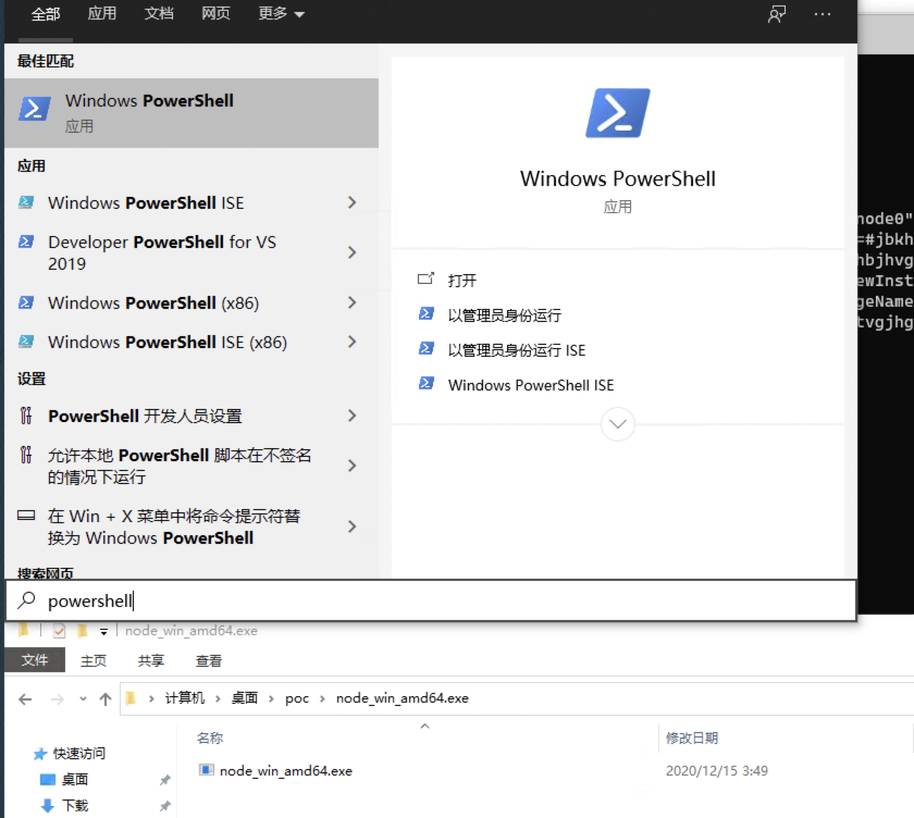
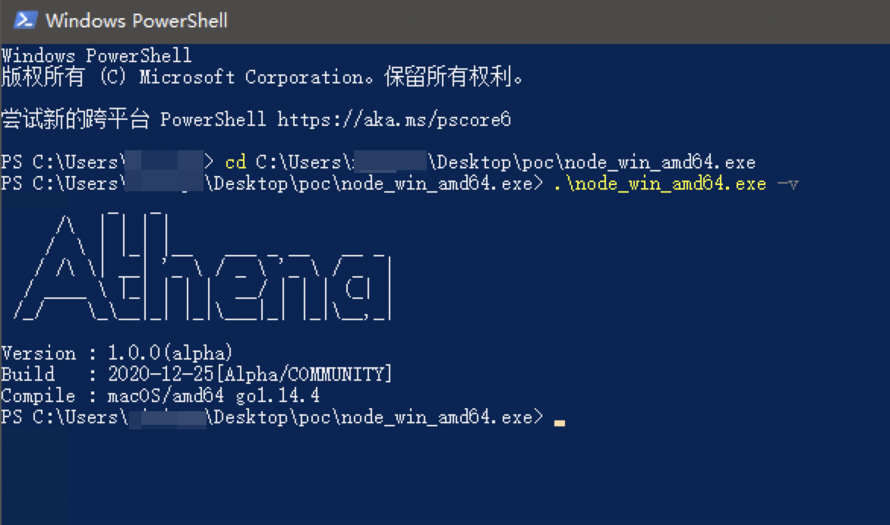
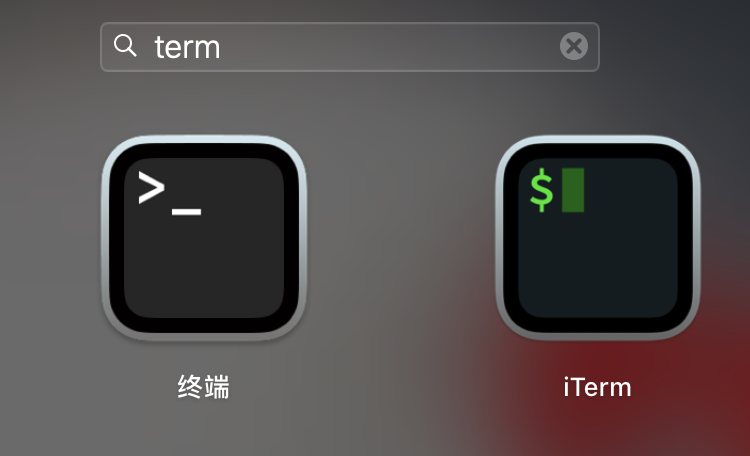
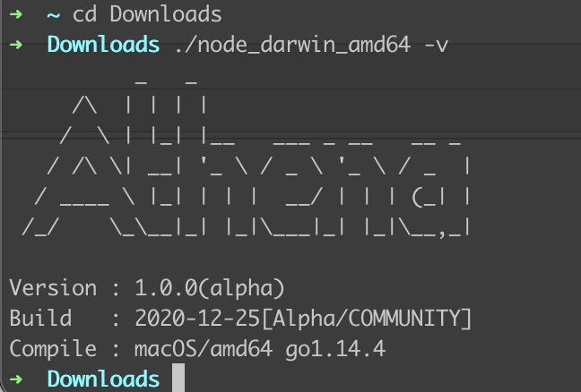

# 下载运行

Athena 为单文件二进制文件，无依赖，也无需安装，下载后直接使用。

## 下载地址

请下载的时候选择最新的版本下载。

+ 唯一指定下载地址，登陆后通过节点管理功能进行下载

Athena 跨平台支持，请下载时选择需要的版本下载。

<!-- tabs:start -->

#### ** Windows **

+ `windows_amd64` Windows x64

系统版本要求大于等于 Windows 7 或大于等于 Windows Server 2008 R2, 不支持 Windows XP、Windows 2003 等低版本系统。

#### ** MacOS **

+ `darwin_amd64` MacOS

支持的系统版本为大于等于 10.10

#### ** Linux **

+ `linux_amd64` Linux x64

要求内核版本大于等于 2.6.23。不支持 CentOS 5, 因为内核太旧了 （2.6.18)。

<!-- tabs:end -->

+ 请下载后自行校验文件 `sha256` 以防被劫持投毒。

## 运行

下载对应系统的版本后，来查看下 Athena 的版本号。

<!-- tabs:start -->

#### ** Windows **

以下载到 `C:\Users\$User\Downloads` 为例，右键解压，就可以得到 `node_win_amd64.exe` 文件了（有的解压软件还会创建一个 `node_win_amd64.exe` 的文件夹，不要和最终的可执行文件混淆了）。

使用桌面左下方的的搜索框，输入 `PowerShell`，点击 `Windows PowerShell`，进入命令终端。

然后 `cd` 到下载目录，运行 `.\node_win_amd64.exe -v` 即可查看 Athena 的版本号。

#### ** MacOS **

打开使用的终端工具，比如 `Terminal` 或者 `iTerm`

然后 `cd` 到下载目录，运行 `./node_darwin_amd64 -v` 即可查看 Athena 的版本号。

#### ** Linux **

以下载到 `~/node_linux_amd64`

然后运行 `./node_linux_amd64 -v` 即可查看 Athena 的版本号。

<!-- tabs:end -->